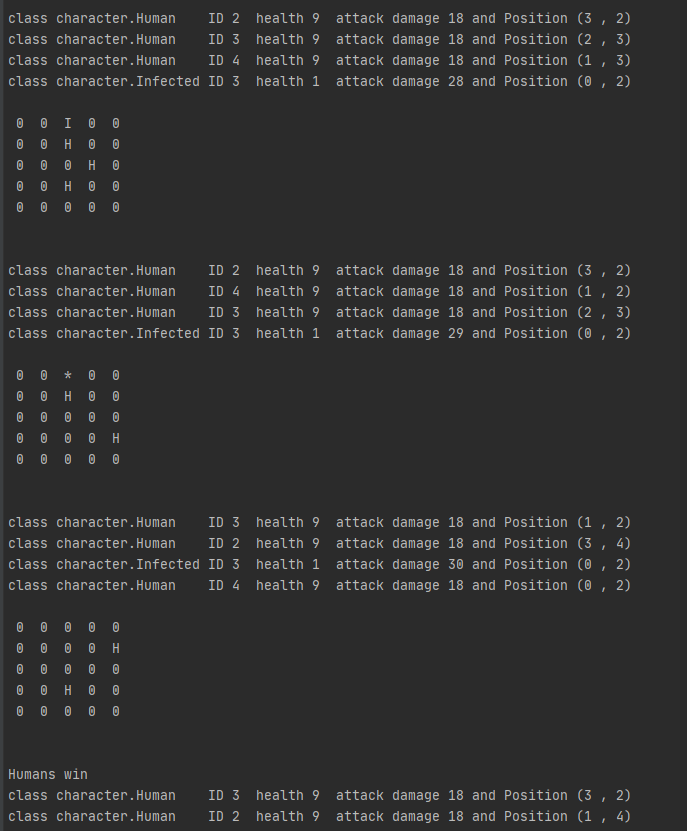

# Apocalypse

An agent-based simulation of an apocalypse

## Usage
Java Version is specified to JDK 14!  
(WIN) Download it and set an environmental variable JAVA_HOME and PATH.

Now you can run this project with - ***gradlew run***

or if you want to specify numbers

***gradlew run --args [numberOfAllies] [numberOfEnemies] [mapHeight] [mapWidth]***

If you pass an invalid argument application will parse a standard number(in this care it's 5).

numberOfAllies + numberOfEnemies must be <= mapHeight * mapWidth

As it is how many spaces there are on board.

## Demonstration

The apocalypse creates a map with specified numbers of humans, infected  and size of the map. 
Characters move around the map and fight each other until one of the nation is extinct. 
This picture represents last few steps of the application. 
Letter H represents Human, Letter I represents Infected and * represents that there are characters of both nations on the same tile fighting each other.

In this case as we you can see Humans won with two survivors. 
After each step the application displays the state of every living creature. 
The state consists of players ID, damage, health and Position starting at (0,0) 
But there is one more interesting thing we didn't point at...

# Conclusions
Simulation's variety comes not only from many random aspects, 
but also from the fact that AttackDamage of Characters of nation - Infected increases by 1 every turn. 
**This means that the bigger the map is the better chance of winning Infected have.**  
Displayed example was created with arguments "5 5 5 5". 
This resulted in Humans victory, but it depends on many random factors. 
The moment we try a bigger map such as "5 5 20 20", Infected are most likely to win.  
You can see the documentation in APOCALYPSE PROJECT.pdf or look up java docs.

